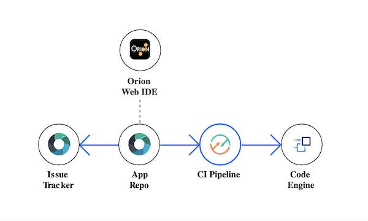

#  Developing a Code Engine app

## How Code Engine deployment works
IBM Cloud Code Engine provides a platform to unify the deployment of all of your container-based applications. Code Engine helps developers by hiding many of the complex tasks like configuration, dependency management etc. Code Engine simplifies container-based management and enables you to concentrate on writing code. It also makes available many of the features of a serverless platform, such as "scale-to-zero". The application code is stored in source control along with its Dockerfile. If you have not yet created a Code Engine project, the toolchain automatically generates one during deployment. Any code changes detected in the Git repo are automatically built, validated, and deployed into the Code Engine project. For more information, refer to the [Code Engine documentation](https://cloud.ibm.com/docs/codeengine).

## Creating a Code Engine app
You can continuously deliver a secure Code Engine app to a Code Engine project. Learn how to create a "Hello World" application that uses Docker, Node.js, and a DevOps toolchain. The app comes preconfigured for continuous delivery with the following features:
* Source control
* Issue tracking
* Online editing
* Deployment to IBM Code Engine

## Prerequisites
* Note that IBM Code Engine is currently in Beta and has [limitations](https://cloud.ibm.com/docs/codeengine?topic=codeengine-getting-started).
* Install the [IBM Cloud CLI and the IBM Cloud Code Engine plug-in](https://cloud.ibm.com/docs/codeengine?topic=codeengine-kn-install-cli).
* Optional: Create a [project](https://cloud.ibm.com/docs/codeengine?topic=codeengine-manage-project). If you do not create one, the toolchain will create one for you.

1. To get started, click **Create toolchain**:
  
2. You can use the default settings, or make changes as needed.
3. Under **Tool Integrations**, select **Delivery Pipeline**.
4. Enter your **IBM Cloud API key**, or generate a new API key by clicking **Create**.
5. Confirm the container registry region, container registry namespace, Code Engine region, Code Engine resource group, and Code Engine project name.
6. If your application integrates with IBM Cloud services, enter a JSON array containing the service instance names.
7. Click **Create**.

The following best practices are implemented automatically upon app creation:
- Sanity check the Dockerfile before image creation.
- Build a container image on every Git commit, setting a tag based on build number, time stamp, and commit ID for traceability.
- Use a private image registry to store the image, and automatically configure access permissions for target cluster deployment by using API tokens that can be revoked.
- Insert the image tag into the deployment manifest automatically.

---
## Learn more

* [Text analysis with Code Engine](https://cloud.ibm.com/docs/solution-tutorials?topic=solution-tutorials-image_classification_code_engine)
* [Getting started with toolchains](https://cloud.ibm.com/devops/getting-started)
* [Getting started with IBM Cloud Continuous Delivery](https://cloud.ibm.com/docs/services/ContinuousDelivery?topic=ContinuousDelivery-getting-started&pos=2)
